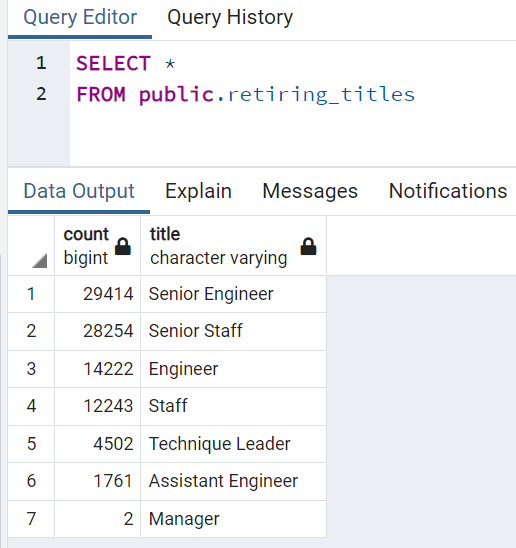
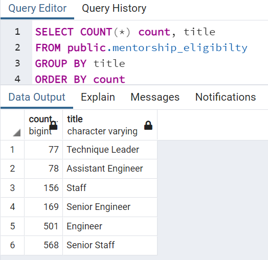

# Pewlett Hackard Analysis

## Overview
The goal of this analysis was to project the number of employees of the company Pewlett-Hackard who might be retiring soon. This analysis helped the company know the number of retirement packages they might offer to the retiring employees, also identifying the positions that will be necessary occupied.  At the end of the project, two more analysis requirements arose from the manager's office to determine the number of retirement employees per title and identify employees eligible to participate in a mentorship program.

## Resources
  - Database: PostgreSQL 13
  - Data Tools: pgAdmin 4 and ANSI SQL
  - Modeling ERD: <a href="https://www.quickdatabasediagrams.com/">Quick DBD</a>
  - Data source: Employees, Departments, Titles and Salaries CSV files.

## Results

**The Number of Retiring Employees by Title**

The criteria to analyze the number of retiring employees by title was to consider the employees, who were born between 1952 and 1955.

 - The Pewlett-Hackard managers need to pay attention to the number of 90,398 retiring employees by title, who represents almost 30% of the total number of the company employees.
 - The most representative numbers of the retiring employees by title are 29,414 Senior Engineer, 28,254 Senior Staff and 14,222 Engineer. There are two employees with the title of Manager who meet the criteria for potential retirement.

**The Employees Eligible for the Mentorship Program**

To analyze the employees eligible for the Mentorship Program we considered who was born in 1965 and continues working in the company.

- There are 1,549 potential employees eligible for the Mentorship Program.
- There are potential employees eligible for mentoring in every title position, except for the Manager position. In this case, the rest of the eligible employees could be a candidate for the Manager mentoring.

## Summary

1. How many roles will need to be filled as the "silver tsunami" begins to make an impact?
2. Are there enough qualified, retirement-ready employees in the departments to mentor the next generation of Pewlett Hackard employees?
